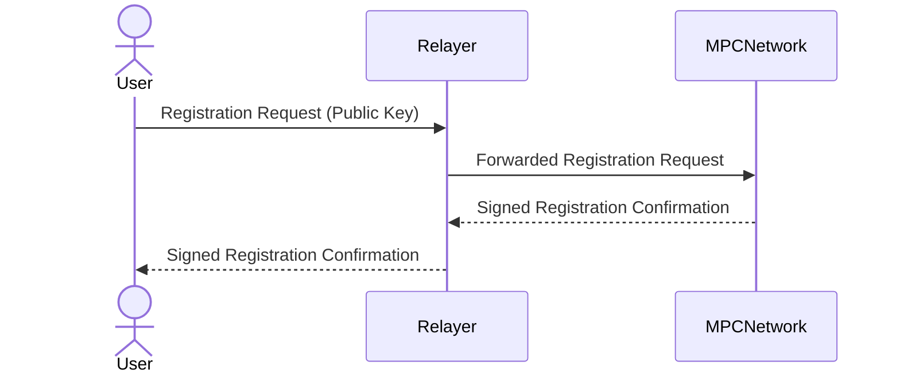
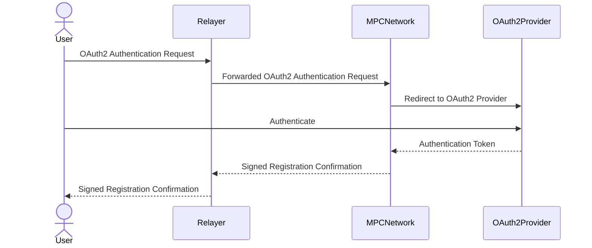
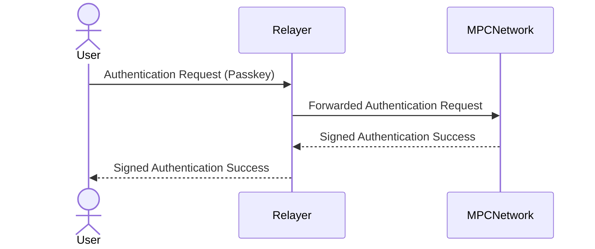
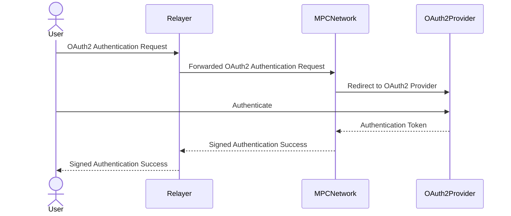
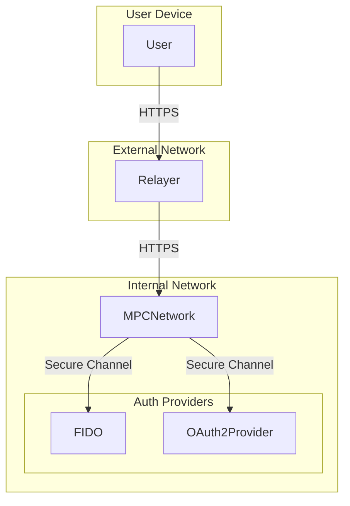
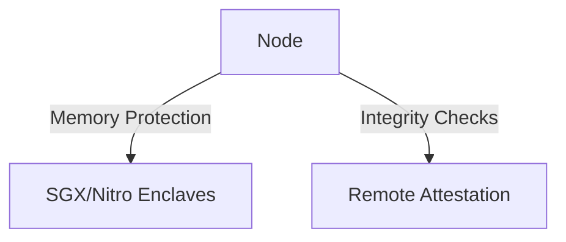
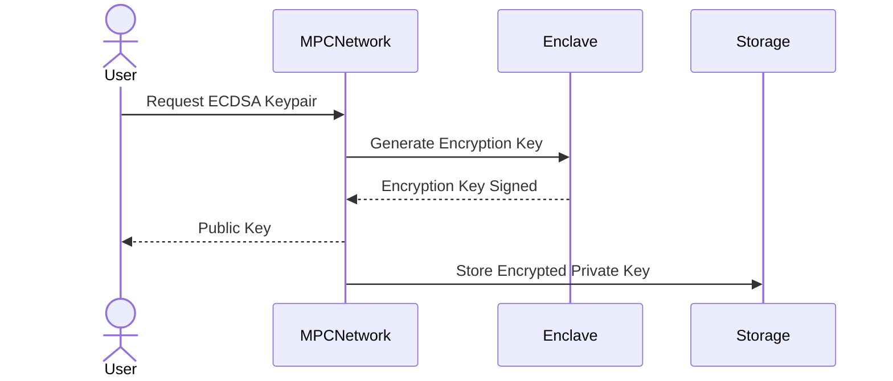
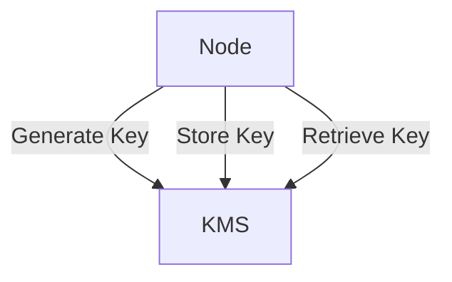
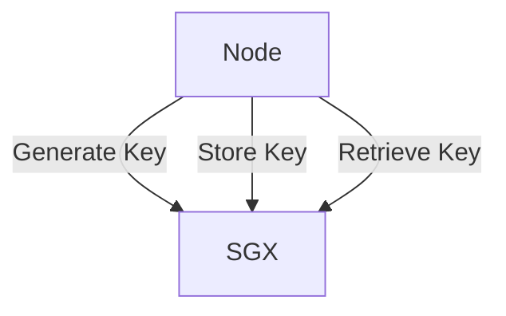

# Distributed MPC Network Protocols

## About the Network
The network consists of 20 nodes, each hosted by an external, distrusted party. The number of nodes in the MPC network is static and does not change. Each node can communicate with other nodes.

- **Node**: A software instance provided by our company.
- **Operator**: A potentially malicious human with admin access to the infrastructure on which the Node runs.
- **User**: An honest actor who can send requests to the MPC network.

## Assumptions
- Nodes communicate via secured channels (e.g., TLS connection).
- The network operates in an honest majority setting, against active and adaptive adversaries.
- The network is synchronous, meaning any message will arrive within a finite time bound.


## Task 1: User Registration and Authentication

### 1.1 User Registration
#### 1.1.1 FIDO Protocol
1. **User** sends a registration request with a public key generated by the **FIDO protocol** to the **Relayer**.
2. **Relayer** forwards the request to the **MPC network**.
3. **MPC network** stores the public key and generates a unique **user** ID.
4. **MPC network** signs the registration confirmation with the majority of **MPC parties**.
5. **Relayer** sends the signed registration confirmation back to the **User**.



#### 1.1.2 OAuth2
1. **User** sends an **OAuth2 authentication** request to the **Relayer**.
2. **Relayer** forwards the request to the **MPC network**.
3. **MPC network** redirects the **user** to the **OAuth2 provider**.
4. **User** authenticates with the **OAuth2 provider**.
5. **OAuth2 provider** sends an authentication token to the **MPC network**.
6. **MPC network** verifies the token, generates a unique **user** ID, and stores the **user** information.
7. **MPC network** signs the registration confirmation with the majority of **MPC parties**.
8. **Relayer** sends the signed registration confirmation back to the **User**.



### 1.2 User Authentication
#### 1.2.1 Passkeys (FIDO Protocol)
1. **User** sends an authentication request with passkey to the **Relayer**.
2. **Relayer** forwards the request to the **MPC network**.
3. **MPC network** verifies the passkey using the **FIDO protocol**.
4. **MPC network** signs the authentication success with the majority of **MPC parties**.
5. **Relayer** sends the signed authentication success back to the **User**.



#### 1.2.2 OAuth2
1. **User** sends an OAuth2 authentication request to the **Relayer**.
2. **Relayer** forwards the request to the **MPC network**.
3. **MPC network** redirects the **user** to the **OAuth2 provider**.
4. **User** authenticates with the **OAuth2 provider**.
5. **OAuth2 provider** sends an authentication token to the **MPC network**.
6. **MPC network** verifies the token and signs the authentication success with the majority of MPC parties.
7. **Relayer** sends the signed authentication success back to the **User**.



### Protobuf Definition

```protobuf
syntax = "proto3";

message FIDORegistrationRequest {
    string public_key = 1;
}

message RegistrationConfirmation {
    string user_id = 1;
    string signature = 2;
}

message FIDOAuthenticationRequest {
    string user_id = 1;
    string passkey = 2;
}

message AuthenticationSuccess {
    string user_id = 1;
    string signature = 2;
}

message OAuth2AuthenticationRequest {
    string user_id = 1;
    string oauth2_token = 2;
}

message OAuth2AuthenticationSuccess {
    string user_id = 1;
    string signature = 2;
}
```

### Deployment Diagram


### Security Considerations
- **Message Passing**: All messages between the **User**, **Relayer**, and **MPC network** are encrypted using **TLS**.
- **Content of Messages**: Messages include user IDs, public keys, passkeys, and authentication tokens. Digital signatures are used to verify the authenticity of messages.
- **Security**: The use of FIDO protocol and OAuth2 ensures strong authentication mechanisms. Digital signatures and majority consensus among MPC parties prevent tampering by malicious relayers.
- **Flow of Requests and Responses**: The flow diagrams illustrate the sequence of interactions between all actors, ensuring clarity in the communication process.
- **Additional Considerations**: Timestamps and nonce values can be included in messages to prevent replay attacks.


## Task 2: Preventing Operator Tampering 
### Cloud (Google Cloud, AWS)
1. **Memory Protection**: Use hardware-based security features like **Intel SGX** or **AWS Nitro Enclaves** to protect memory.
2. **Tampering Detection**: Implement integrity checks and remote attestation to detect tampering.



#### Security Considerations:

1. **Hardware-based security** features prevent memory dumping.
2. **Integrity checks and remote attestation** detect tampering.

## Task 3: ECDSA Keypair Generation and Storage

### Protocol Design
1. **Encryption Key Generation**: The encryption key is generated inside the node’s secure enclave (e.g., **Intel SGX**).
2. **Key Storage**: The encryption key is stored securely within the enclave.
3. **Key Retrieval**: The node retrieves the encryption key from the enclave when needed signed by the majority of the participants in the protocol.
4. **Encryption/Decryption**: The ECDSA private key is encrypted/decrypted inside the enclave.



### Cloud (Google Cloud, AWS)
1. **Encryption Key Generation**: Use **AWS KMS** or **Google Cloud KMS** to generate encryption keys.
2. **Key Storage**: Store keys securely in **KMS**.
3. **Key Retrieval**: Nodes retrieve keys from **KMS** when needed.



### Bare Metal
1. **Encryption Key Generation**: Use **Intel SGX** to generate encryption keys.
2. **Key Storage**: Store keys securely within the SGX enclave.
3. **Key Retrieval**: Nodes retrieve keys from the SGX enclave when needed.



#### Security Considerations:

1. Encryption keys are generated and stored securely within hardware-based enclaves.
2. Operators cannot access or decrypt user data as keys are protected within the enclave.